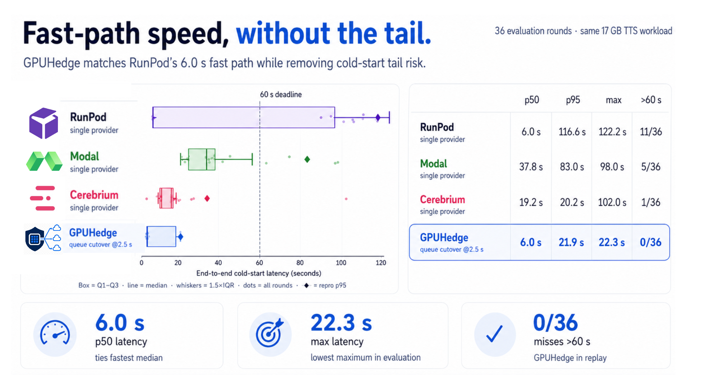

# GPUHedge

**Hedge one request across RunPod, Modal, and Cerebrium to cut serverless-GPU
cold-start latency — and pay less than the cheapest single provider.**



## Install

```bash
pip install gpuhedge
gpuhedge demo        # simulated providers, real policy engines — no accounts, no spend
```

The demo races a bimodal primary against a steady hedge through the exact code
paths that run against real clouds — including a malformed result the
validator rejects and a queued-cancel cutover.

## Quickstart

```python
from gpuhedge import Router
from gpuhedge.policies import StateAwarePolicy

router = Router(
    primary="runpod", hedge="cerebrium",
    policy=StateAwarePolicy(queue_cutover_ms=2_500, safety_hedge_ms=8_500),
)
outcome = await router.run()
outcome.winner          # "runpod" | "cerebrium"
outcome.total_ms        # end-to-end latency from request start
outcome.cancellation    # the loser's audited cancellation receipt
```

Providers, rates, and your request live in a small YAML file; the demo above
runs the same `Router` against simulated backends so you can try every policy
before wiring up an account. [Point it at real clouds ↓](#run-it-against-real-clouds)

## What it does

1. **Submit** to the cheap/fast primary.
2. **Watch** its lifecycle state — queue vs running, not just a timer.
3. **Hedge** to another provider only when the primary enters its tail — and
   escalate to a third if the hedge stalls too (`CascadePolicy`, never more
   than two live jobs).
4. **Validate** — the first result that passes your validator wins; a fast
   HTTP 200 with malformed output does not.
5. **Cancel** every loser through its provider-native API and record an
   audited receipt (evidence level, wasted GPU-$, leak flag).

## Motivation

Serverless GPU cold starts are brutally bimodal: a warm-path hit returns in
seconds, a cold miss takes minutes, with nothing in between. GPUHedge submits
your request to a cheap primary, watches its lifecycle state, and launches a
backup on another cloud *only* when the primary is heading into its tail —
then returns the first valid result and cancels the loser.

On a 17 GB TTS model across three real providers, the default 10-second hedge:

- **cut p95 cold-start latency 4×** — 116.6 s → 29.4 s;
- **eliminated every deadline miss** — 11/36 → 0/36 over 60 s;
- **cost less than running the cheapest provider alone** — −27% active-compute
  (−11% including idle-window billing): a cancelled backup beats an un-hedged
  100-second tail;
- **launched a backup on only 31% of requests** — the fast path is left alone
  the rest of the time.

## Policies

| policy | when it launches a backup |
| --- | --- |
| `SingleProvider()` | never — the baseline |
| `FixedHedgePolicy(hedge_after_ms)` | timer: launch the hedge at `t = d` |
| `StateAwarePolicy(queue_cutover_ms, safety_hedge_ms)` | poll the primary's queue state; cancel it *before its worker starts* and switch if still queued |
| `CascadePolicy(queue_cutover_ms, safety_hedge_ms, escalate_after_ms)` | cutover, then escalate to a third provider if the hedge stalls |

Custom policies plug in through one method — implement `async def
execute(self, ctx)` and `min_providers` and yours runs like the built-ins.
Validators are pluggable too (`wav`, `json`, `nonempty`, or
`register_validator("mine")(...)`). See [`docs/policies.md`](docs/policies.md).

## Providers

Built-in adapters: **RunPod** (Flash queue SDK + REST), **Modal**
(`FunctionCall.spawn`/`cancel`), **Cerebrium** (sync-first REST), a
**simulator** (`adapter: sim`), and a **generic HTTP adapter** (`adapter:
http`) that turns any submit/status/result/cancel service into a raceable
backend from YAML — no Python. Adding your own is one class with four methods:
[`docs/adding-a-provider.md`](docs/adding-a-provider.md).

## Run it against real clouds

```bash
pip install "gpuhedge[providers]"   # or a subset: gpuhedge[runpod], [modal], [cerebrium]

# drop the example config into ./config/ and fill in your endpoint ids /
# app names, then set deployed: true (gpuhedge reads ./config/benchmark.yaml)
mkdir -p config && python -c "import shutil,importlib.resources as r; \
shutil.copy(r.files('gpuhedge')/'config'/'benchmark.example.yaml','config/benchmark.yaml')"

gpuhedge login-check                # verifies auth, spends nothing
gpuhedge plan                       # what the config encodes, incl. budget gates
gpuhedge cutover --go               # one live state-aware request
```

Nothing submits a GPU job without `--go`. A projected-cost ledger enforces
hard budget gates (`BudgetExceeded` halts submission), and `gpuhedge costs`
reconciles projections against provider-reported billing. Deployment recipes
for the benchmark model on all three providers are under [`deploy/`](deploy/).

## Benchmark

The headline numbers come from a reproducible 2026-07 study: the same 17 GB
MOSS-TTS model, same request, identical WAV validation on every arm, 54 paired
cold-start rounds across RunPod, Modal, and Cerebrium. Every (sanitized) trace
is committed, so the tables reproduce with `gpuhedge replay
traces/moss_rounds.jsonl`.

| Policy (36 evaluation rounds) | p50 | p95 | miss >60 s | $/req (active) |
| --- | ---: | ---: | ---: | ---: |
| single: RunPod (cheapest single provider) | 6.0 s | 116.6 s | 11/36 | $0.0114 |
| **fixed hedge → Cerebrium @10 s** | **6.0 s** | **29.4 s** | **0/36** | **$0.0083** |
| queue cutover @2.5 s | 6.0 s | 21.9 s | 0/36 | $0.0056 |

Full method, figures, cost models, and a **pre-registered live validation**
(with account-level billing deltas and forced loser-cancellations on all three
providers) are in [`benchmarks/`](benchmarks/). The validation is reported
honestly, including where a hedge-provider tail made the cutover's p95 win
estimator-sensitive at n=20 — the case that motivated `CascadePolicy`.

## Docs

[architecture](docs/architecture.md) ·
[policies](docs/policies.md) ·
[provider capabilities](docs/provider-capabilities.md) ·
[cancellation semantics](docs/cancellation-semantics.md) ·
[cost accounting](docs/cost-accounting.md) ·
[adding a provider](docs/adding-a-provider.md)

## Status & caveats

- Benchmark data is one workload (TTS), one region per provider, collected over
  two days in 2026-07. Provider rankings move — that is the argument *for*
  state-aware routing. Treat any single number as a snapshot.
- The Cerebrium adapter is **benchmark-safe, not concurrency-safe** (it
  discovers run ids from the runs list); see
  [`docs/provider-capabilities.md`](docs/provider-capabilities.md).
- n is in the tens: miss rates carry Wilson 95% intervals and no p99s are
  quoted anywhere.

## Contributing

`make dev && make lint && make test`. CI runs Python 3.10–3.12, a wheel smoke
test, and regenerates the benchmark figures. Adapter contributions welcome —
see [`docs/adding-a-provider.md`](docs/adding-a-provider.md) and
[`CONTRIBUTING.md`](CONTRIBUTING.md).

## License

Apache-2.0.
