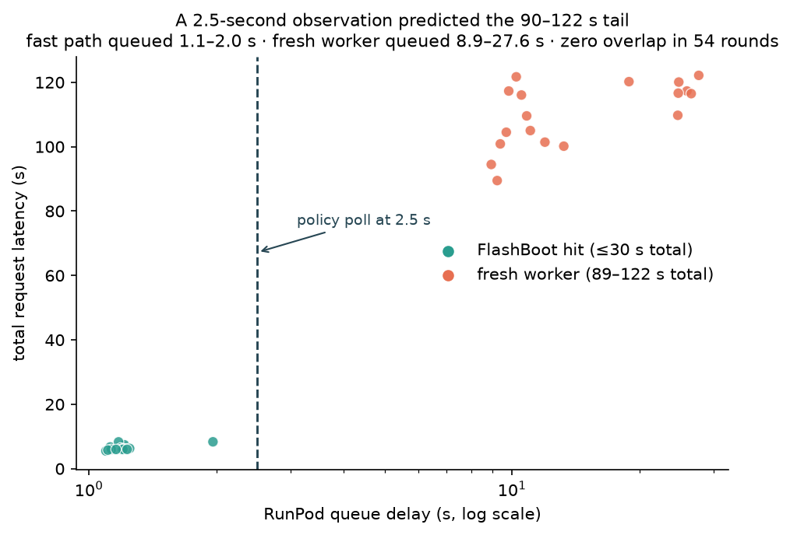
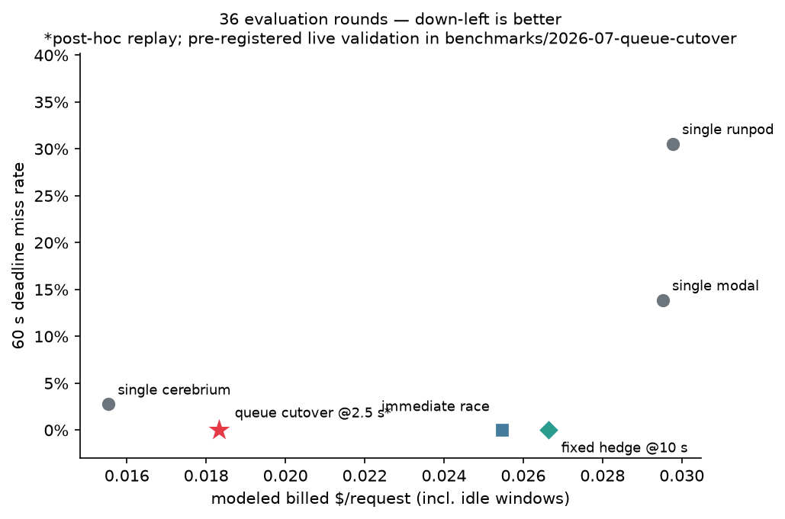
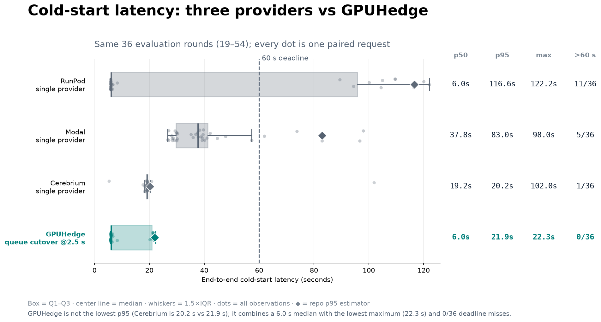
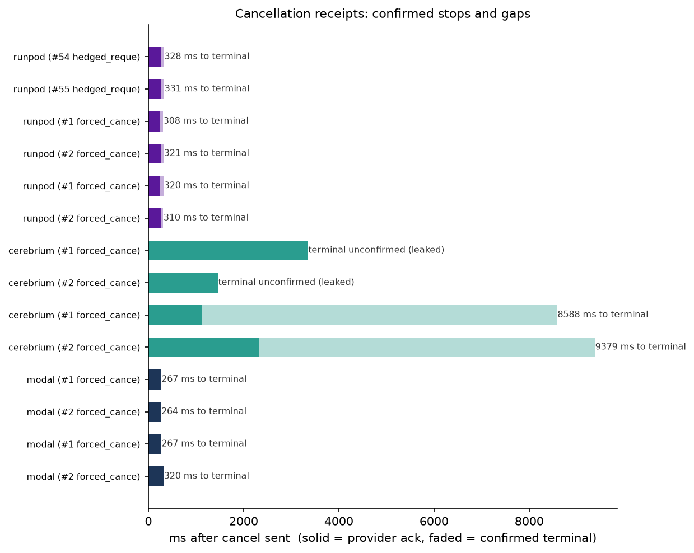

# Results — 2026-07 three-provider MOSS-TTS cold-start benchmark

Data: 54 paired cold rounds + warm companions + 18 live hedged requests,
2026-07-11 18:00 → 2026-07-12 00:55 UTC. Sanitized traces committed in
[`../../traces/`](../../traces/) (ids remapped, balances withheld; every
latency/receipt/spend delta untouched); method in
[methodology.md](methodology.md); regenerate everything with
`gpuhedge replay traces/moss_rounds.jsonl` and `python analysis.py`.

## Headline

> On 36 evaluation rounds, the `runpod → cerebrium @ 10 s` hedge cut p95
> latency from **116.6 s to 29.4 s** and 60-second misses from **11/36 to
> 0/36**, launching a second job on only **11/36** requests. In 18 live
> races, 3/3 losing jobs were remotely cancelled with 254–309 ms acks and
> zero leaks.

On cost: the hedge cut **modeled active-compute** cost 27% ($0.0114 →
$0.0083/req). That is *not yet* "the bill fell 27%" — with idle windows
included the modeled billed gap is ~11%, and the account-level experiment is
pre-registered in [`../2026-07-queue-cutover/`](../2026-07-queue-cutover/).

## Cold starts (54 paired rounds)

| Provider | GPU | valid | p50 | p95 | max | miss>30s | miss>60s |
| --- | --- | --- | ---: | ---: | ---: | ---: | ---: |
| RunPod | RTX 4090 | 54/54 | **6.1 s** | 120.1 s | 122.2 s | 33% | 33% |
| Modal | L40S | 54/54 | 38.4 s | 96.8 s | 111.6 s | 81% | 15% |
| Cerebrium | L40S | 53/54 | 19.3 s | 98.5 s | 104.3 s | 13% | 13% |

- **RunPod is cleanly bimodal**: FlashBoot hits 36/54 (67%) at 6–8 s wall
  *including generation*; misses 89–122 s; nothing in between.
- **Warm companions** decompose the cold cost: warm generation is ~4–5 s on
  every provider, so the differences above are pure infrastructure delay.
- **The queue delay predicts the mode** (fig 1): fast-path requests queued
  1.1–2.0 s, fresh-worker requests 8.9–27.6 s — zero overlap in 54 rounds,
  and the boundary is identical using calibration rounds only.

## Policy replay — 36 evaluation rounds

Frozen-parameter policies replayed on rounds 19–54 (an *evaluation set*, not
a strict holdout — see methodology). "active $" = execution × rate with the
loser idealized-cancelled; "billed $" adds the primary's 60 s idle window
per worker start; queued cancels assumed unbilled pending live validation.

| Policy | p50 | p95 | miss>60s (95% CI) | active $/req | billed $/req | hedge rate |
| --- | ---: | ---: | ---: | ---: | ---: | ---: |
| single:runpod | 6.0 s | 116.6 s | 11/36 (18–47%) | $0.0114 | $0.0298 | — |
| single:modal | 37.8 s | 83.0 s | 5/36 (6–29%) | $0.0295 | $0.0295 | — |
| single:cerebrium | 19.2 s | 20.2 s | 1/36 (0–14%) | $0.0155 | $0.0155 | — |
| race runpod+cerebrium (d=0) | 6.0 s | 19.4 s | 0/36 (0–10%) | $0.0097 | $0.0255 | 36/36 |
| **hedge runpod→cerebrium@10s** | **6.0 s** | **29.4 s** | **0/36 (0–10%)** | **$0.0083** | **$0.0266** | **11/36** |
| hedge runpod→modal@10s | 6.0 s | 49.6 s | 1/36 (0–14%) | $0.0133 | $0.0317 | 11/36 |
| queue cutover @2.5 s (post-hoc) | 6.0 s | 21.9 s | 0/36 (0–10%) | $0.0056 | $0.0183 | 11/36 |

The cutover row is a **post-benchmark discovery replayed on data that
informed it**. Its pre-registered validation found p95 28.2 s versus 31.0 s
for fixed hedging, but also one 104.2 s Cerebrium outlier; see
[`../2026-07-queue-cutover/results.md`](../2026-07-queue-cutover/results.md).

The logo-free Matplotlib source for the manually polished README hero is
regenerated from the same traces as `fig5_gpuhedge_boxplot.png` and `.svg`:

## Live hedging & cancellation (18 requests)

All 18 returned valid audio; end-to-end, 17/18 within 60 s (one Modal-hedge
win at ≈67 s — the runpod→modal arm the replay already ranks worse). Hedge
launched on 3/18; **all three cancelled losers were RunPod's** (Modal and
Cerebrium only ever won), acks 254–309 ms, cancel→terminal 322–388 ms, zero
leaks. The subsequent forced audit found RunPod terminal proof on 4/4
attempts and Cerebrium on 2/4 (both early attempts leaked). Modal's first
audit pass failed 4/4 on an API rejection the adapter swallowed; after the
fix a re-audit succeeded 4/4 via input-cancel (the API rejects container
termination). See `traces/cancel_audit.jsonl`; cancellation support is not
equivalent across providers.

## Cost

Projected ledger through Stage 3: **$5.85** (setup $0.33, qualification
$0.13, Stage 2 $4.91, Stage 3 $0.47). Including the later 60-request
validation and cancellation audit, the final projected ledger was **$7.73**.
The observable account APIs showed $6.32 (RunPod $2.97 + Modal $3.35), with
Cerebrium unavailable at account level.
Reconciliation insight: at a 60 s idle timeout, RunPod's balance delta ran
~3× the summed per-job `executionTime` — idle windows and storage dominate;
see [../../docs/cost-accounting.md](../../docs/cost-accounting.md).

## Interpretation

1. **Tails are large, bimodal, and mutually uncorrelated enough** that a
   two-of-three hedge removed every 60 s miss in evaluation while hedging
   ~1/3 of requests.
2. **The hedge partner matters more than the mechanism**: Cerebrium's tight
   ~19 s cold path made it the better hedge; the Modal hedge was *more*
   expensive than not hedging. A production router must keep learning this
   ranking — it moves.
3. **Cadence is a confounder and an opportunity**: FlashBoot's 67% hit rate
   is specific to steady ~2.5 min traffic (an idle-heavy probe saw 2/7).
   Idle-aware routing is the natural extension.
4. **Queue state beats timers**: by 2.5 s the primary's own lifecycle state
   already separates 6 s requests from 100 s requests, so the best policy
   cancels before the worker starts instead of waiting out a 10 s timer.

## Caveats

- Single workload/region/evening; n=36 evaluation rounds (every 0/36 cell
  carries a ~10% Wilson upper bound); no p99s anywhere.
- Rounds 13 (lost arm) and 49 (warm-contaminated) flagged in traces.
- The evaluation set is not a strict holdout; the hedge-provider ranking was
  read from the full data. The pre-registered validation exists precisely
  to close this class of gap for the headline policy.
